# Informe de Laboratorio 3 - TDD
## Integrantes:
* [Diego Macia](https://github.com/thesrcielos)
* [Miguel Motta](https://github.com/MIGUEL-MOTTA-U)

## DESCRIPCIÓN DEL PROYECTO

### Crear el proyecto
Comando ejecutado para crear el proyecto con las especificaciones dadas:

> ```
> mvn archetype:generate -DarchetypeGroupId=org.apache.maven.archetypes -DarchetypeArtifactId=maven-archetype-quickstart -DarchetypeVersion=1.4
> ```
> 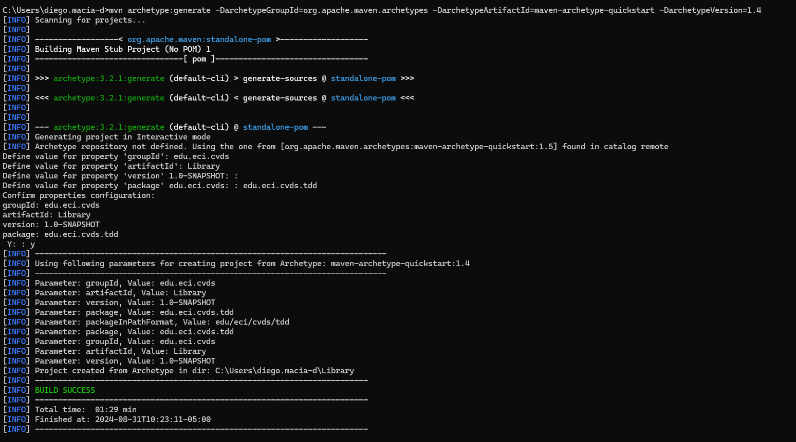

### Agregar dependencia JUnit5
Editando el archivo `pom.xml` con las siguientes lineas, podemos agregar las dependencias de JUnit 5 a nuestro proyecto:
> ```
> <dependencies>
>    <dependency>
>    <groupId>org.junit.jupiter</groupId>
>      <artifactId>junit-jupiter-api</artifactId>
>      <version>5.11.0</version>
>      <scope>test</scope>
>    </dependency>
>  </dependencies>
> ```
> 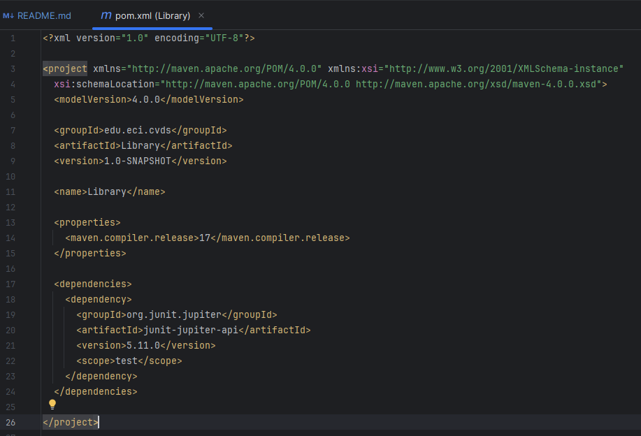
### Agregar esqueleto del proyecto
Desde editor `InteliJ`:

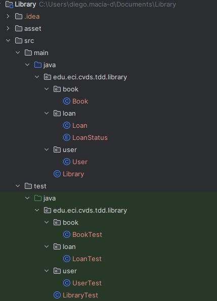

Desde la consola de comandos:

> `tree`

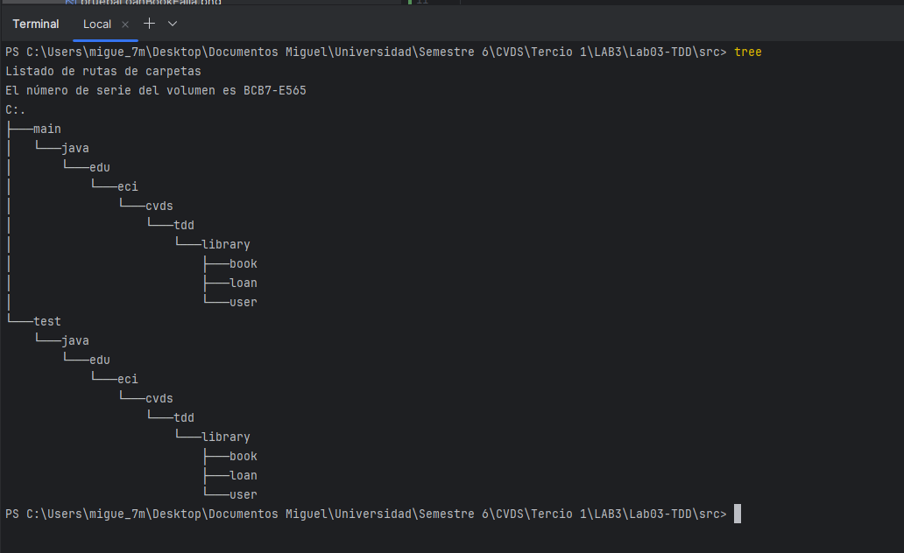

### Agregar clases
Comprobación de clases en el proyecto ejecutando `mvn package`:

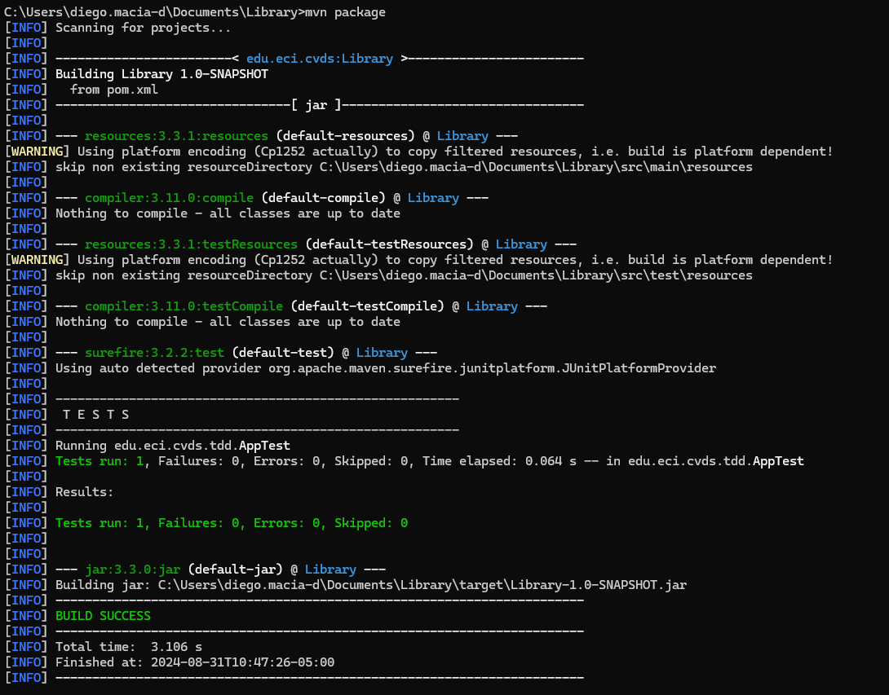

## PRUEBAS UNITARIAS Y TDD
### Crear Clase de Prueba
Se creo la clase `LibraryTest` y a partir de ahí se hizo el desarrollo de los métodos y pruebas de `addBook, loanBook y returnLoan`.
#### Método addBook
Se hizo el primero commmit para crear la prueba antes que la implementación (debe fallar) [commit.](https://github.com/thesrcielos/Lab03-TDD/commit/1653f876bf8cdb5f31608b786cc7f1693b194f71)

>```
> public void addBookTest(){
>        Book book = new Book("example title","pepe","1717263847194");
>        Library library = new Library();
>        assertTrue(library.addBook(book));
>    }
>```
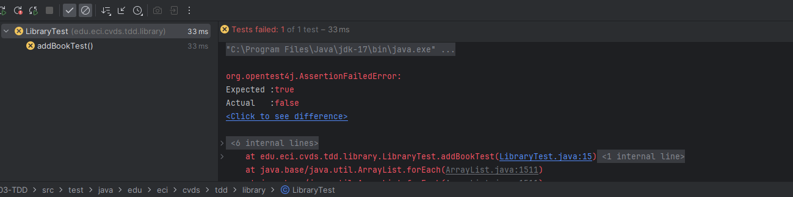

Luego se implementa el método [addBook()](https://github.com/thesrcielos/Lab03-TDD/commit/b07206a2619a9114e205046cc8f1b60ad98d8a96):

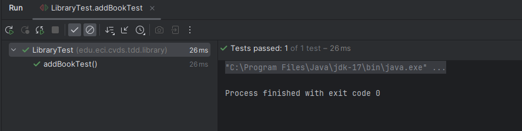

#### Método loanBook
Se hizo el primero commmit para crear la prueba antes que la implementación (debe fallar) [commit.](https://github.com/thesrcielos/Lab03-TDD/commit/0a8c3c8a4ec56426c56ba535c6b748cc294afa4c)

>```
>    @Test
>    public void loanABookTest(){
>        String userId = "1";
>        String isbn = "1717263847194";
>        Library library = createExampleLibrary(userId, isbn);
>        assertNotNull(library.loanABook(userId,isbn));
>    }
>```
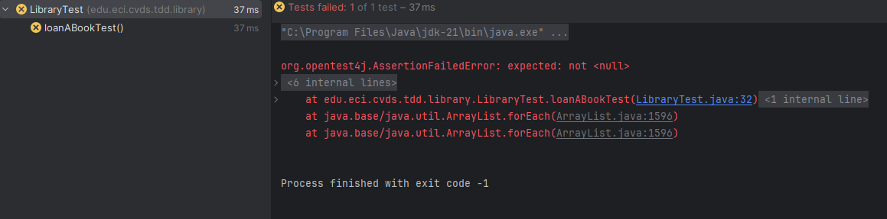

Luego se implementa el método haciendo la primera `pull request` de [loanBook](https://github.com/thesrcielos/Lab03-TDD/commit/4ea5e6601980f0404c8307a40b721bd75ae4ae2f):

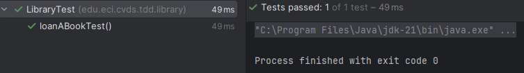

#### Método returnLoan
Se crea la prueba de [`returnLoan`](https://github.com/thesrcielos/Lab03-TDD/commit/479ec866ad49f14526a5c34e080551aba9b0f95d) fallida:
>```
>    @Test
>    public void returnLoanTest(){
>        String userId = "1";
>        String isbn = "1717263847194";
>        Library library = createExampleLibrary(userId,isbn);
>        Loan loan = addLoanToLibrary(library);
>        assertNotNull(library.returnLoan(loan));
>    }
>```


Luego se implementa el método [`returnLoan`](https://github.com/thesrcielos/Lab03-TDD/commit/e87328c453309d895866942f0a1b521748202c13):


### Cobertura
Modificando `.pom` para implementar análisis de cobertura de Jacoco:
> 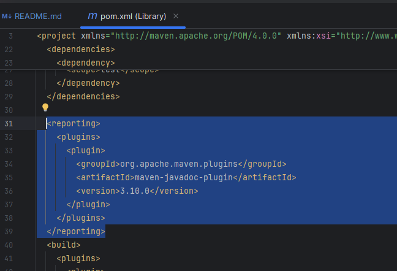
> 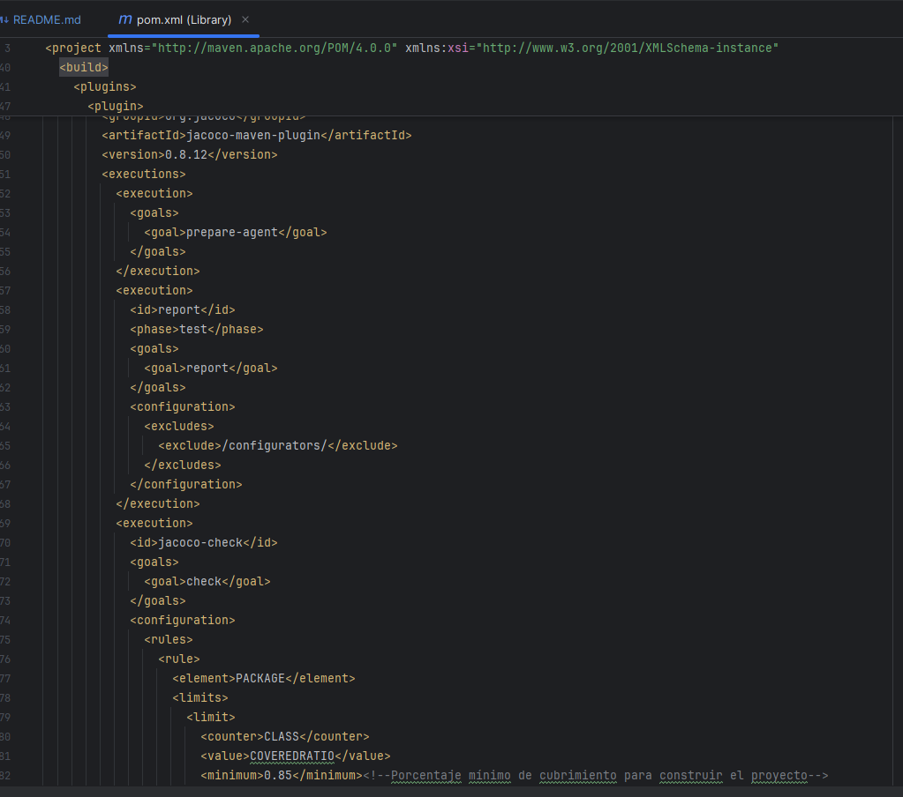

Luego compilamos el proyecto para generar el análisis de cobertura:
> 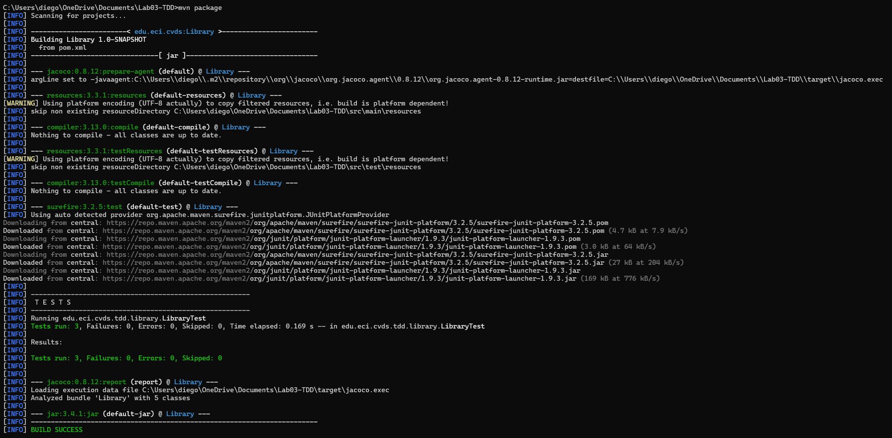

JaCoCo (Java Code Coverage) es una herramienta que nos ayuda a 
evaluar con métricas, la cobertura actual de pruebas unitarias que 
tiene el proyecto.

Ahora en los archivos generados, luego de compilar hay que muestra el análisis
de la cobertura de las pruebas de unidad:

*Del proyecto*
> 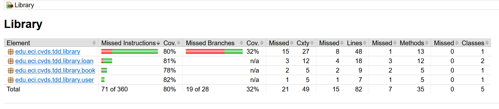

*De la clase Library*
> 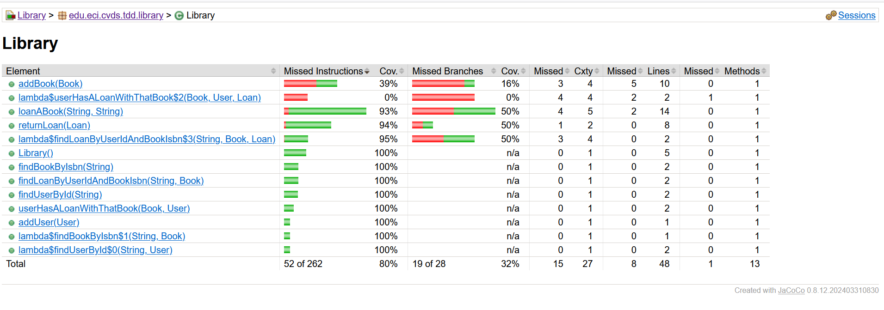

### SonarQube
SonarQube, del mismo modo que Jacoco, es una herramienta que permite
hacer una evaluación del código, pero a diferencia de Jacoco, genera un análisis
de calidad del código, abarcando posibles bugs, vulnerabilidades, "code smells" y 
seguridad.

Para poder implementar Sonar se debe descargar una imágen del proyecto usando Docker, 
en este caso con una extensión:
> 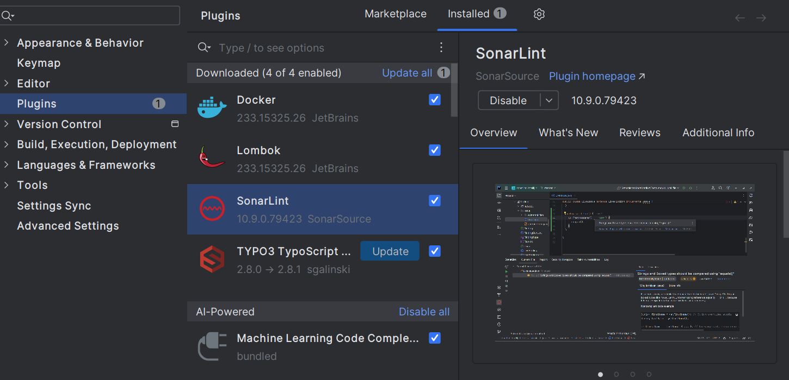

Luego corriendo los comandos para iniciar el servicio de SonarQube luego de generar
la imagen con Docker, corriendo el servicio http por el puerto 9000 que nos permite 
acceder al menú login de sonar y generar el token:

> 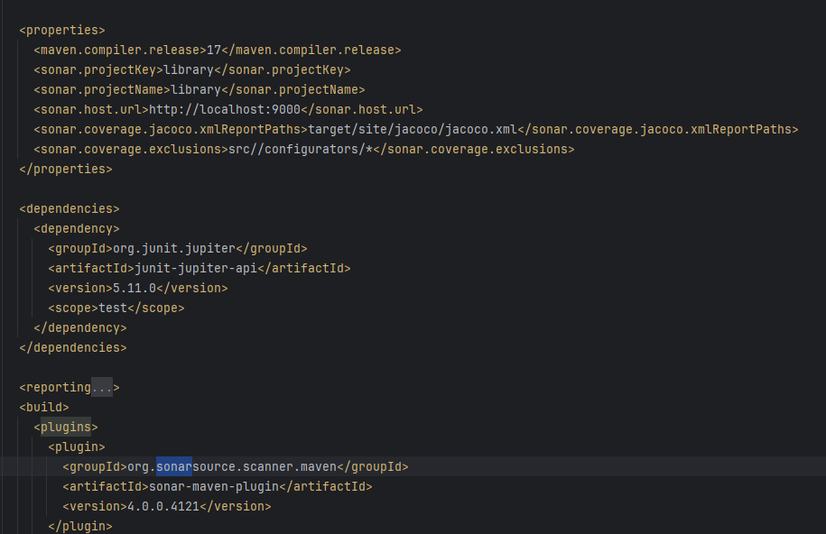

> 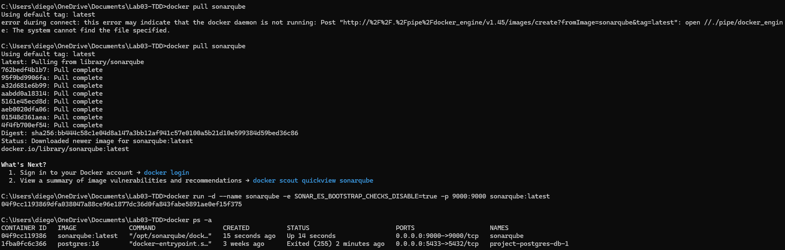

> 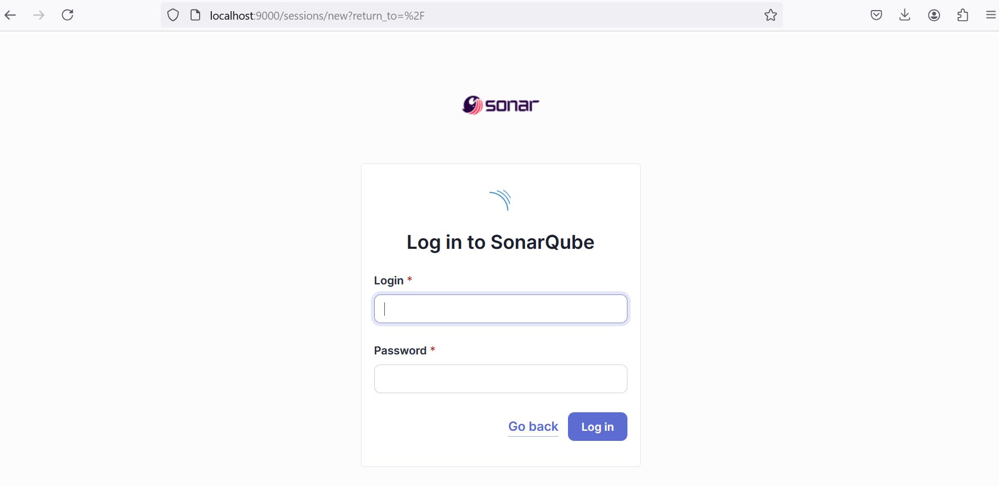

> 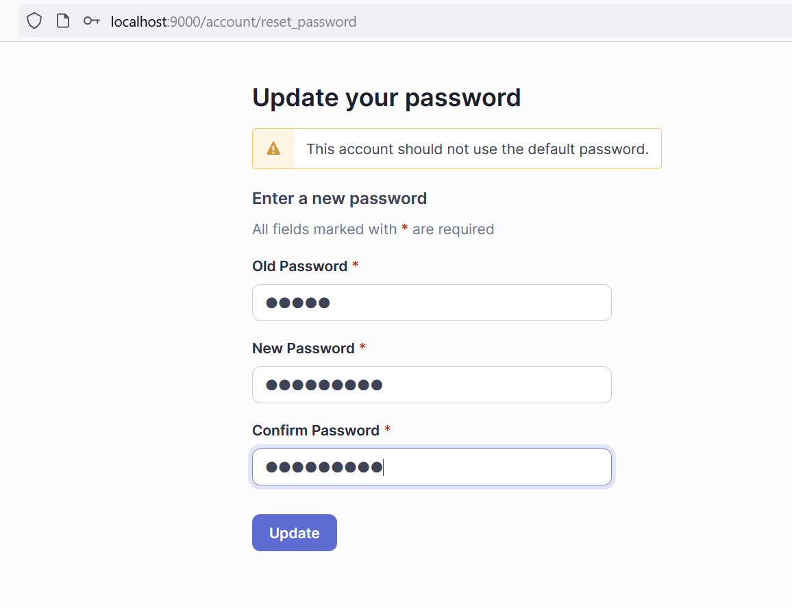

> 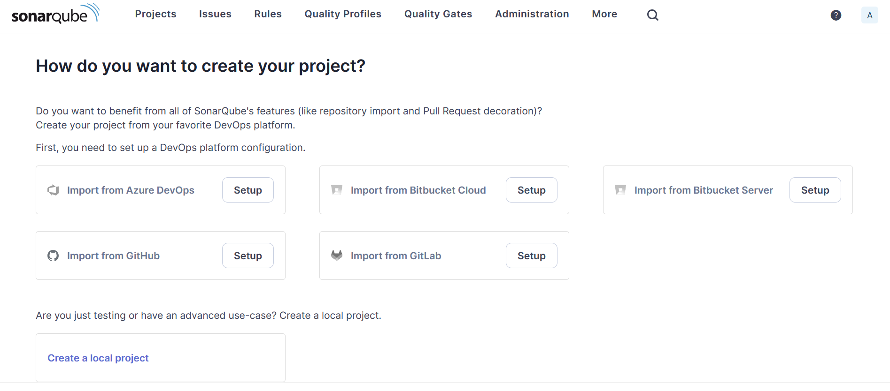

> 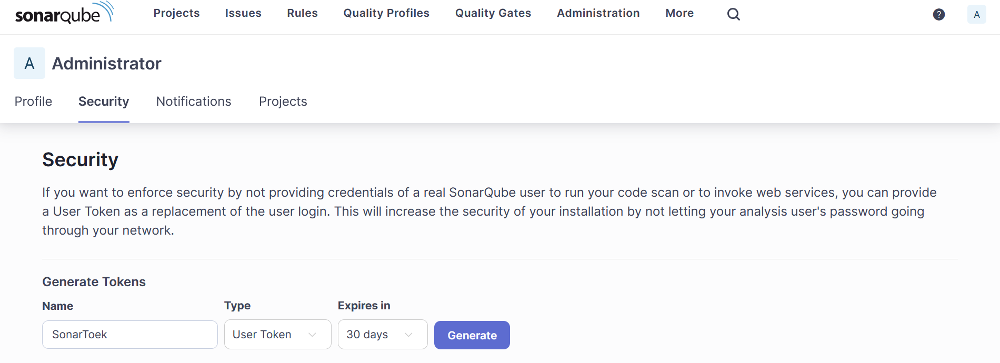

Se compila el proyecto ahora con la implementación de Sonar verificando que esté correctamente
enlazada la dependencia en el archivo `.pom`:

> 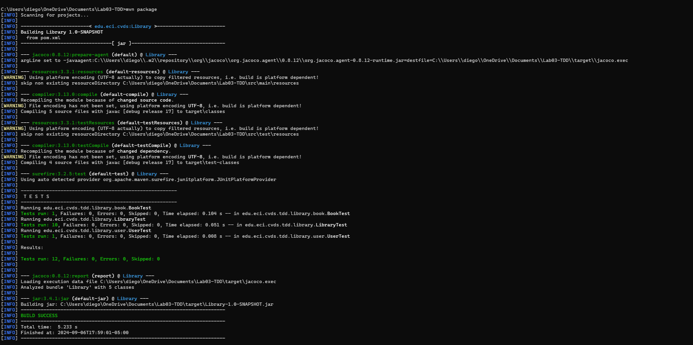

Luego de cubrir las pruebas de unidad requeridas:
> 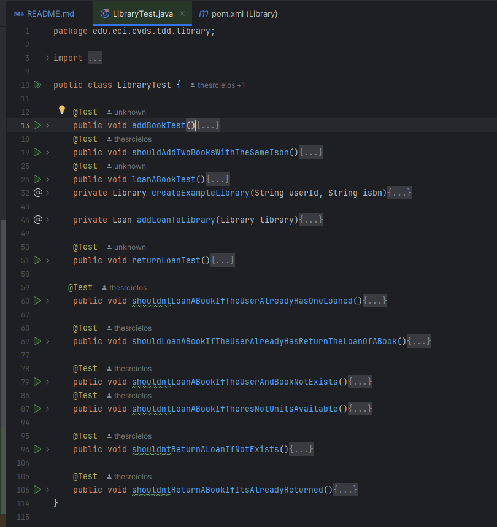

> 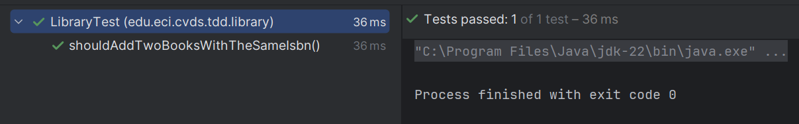

> 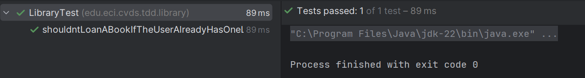

> 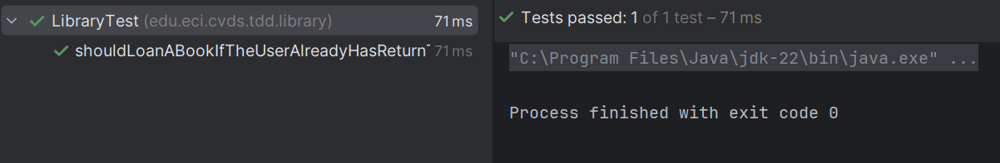

> 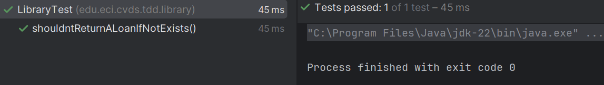

> 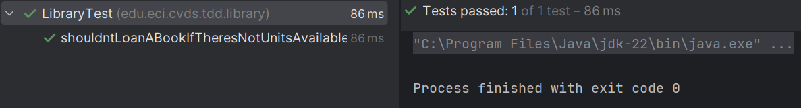

> 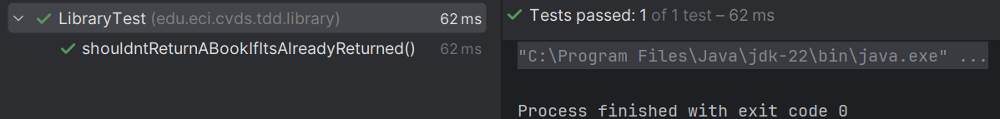

> 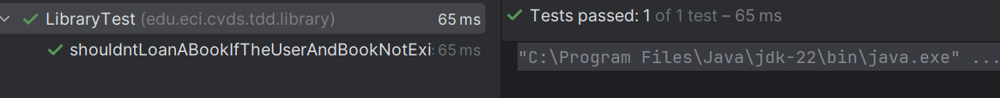

Los resultados de cobertura son:

*Del proyecto*
> 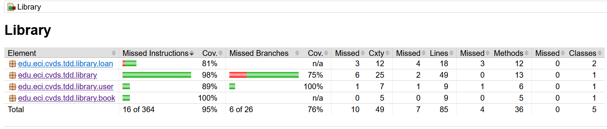

*De la clase Library*
> 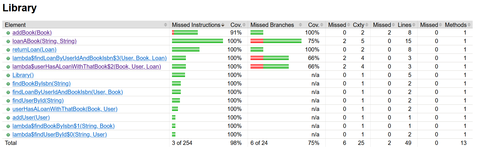

Luego, compilamos el código con las pruebas de unidad implementadas y el escaneo de 
Sonar:

> .png)

> .png)

Luego se genera la integración de análisis con sonar:
> `mvn verify sonar:sonar -D sonar.token=squ_7a0d6cc43acbe849db176349aa3ef52c127e9c7d` # (el token generado).

> 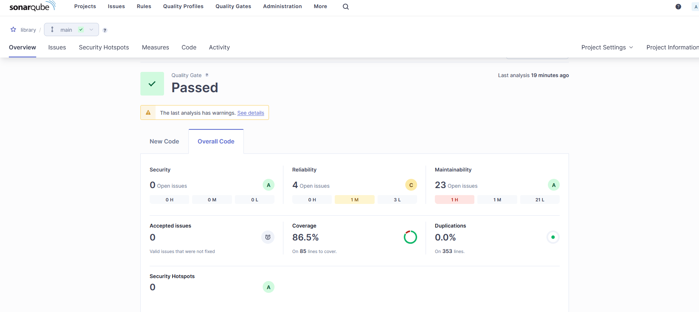

